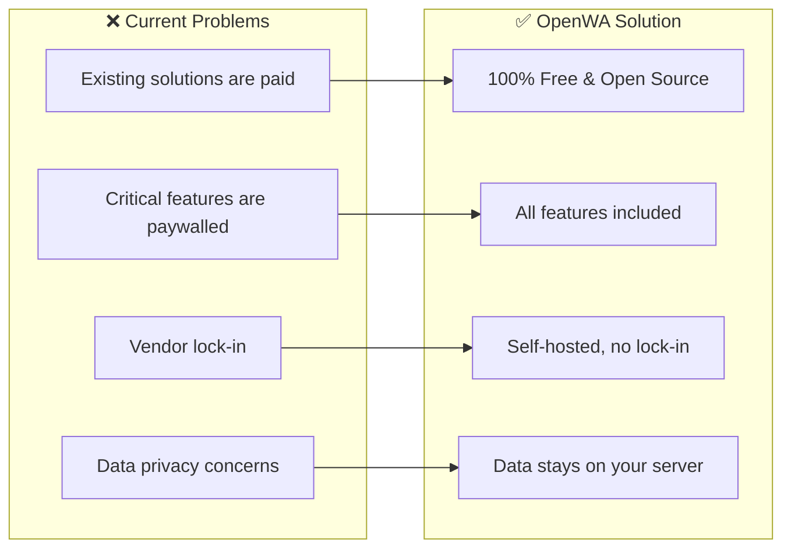
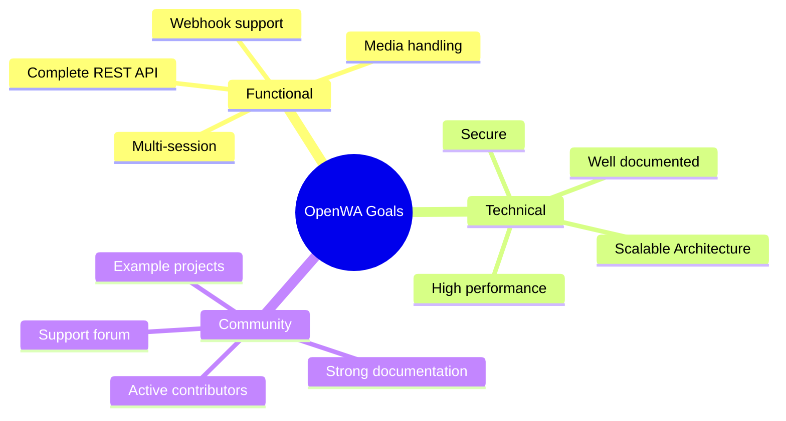
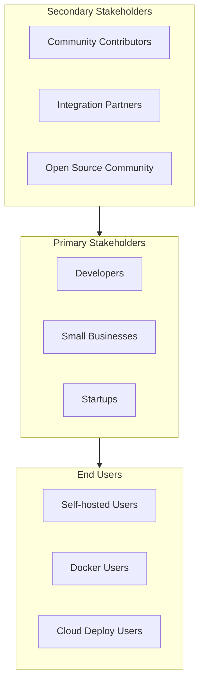
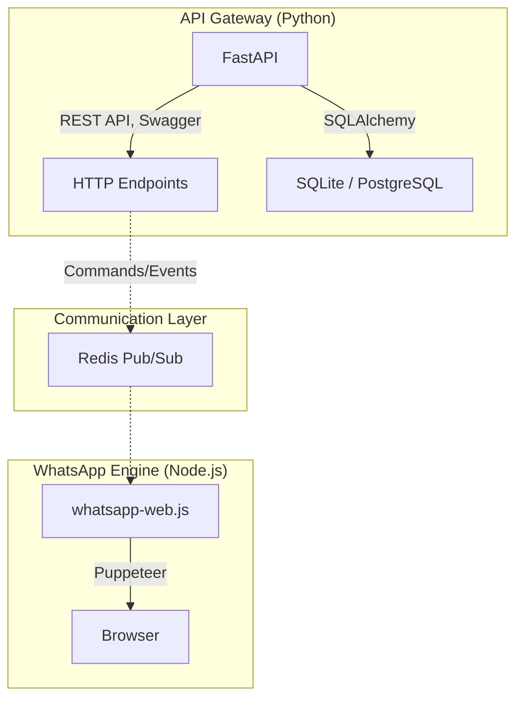

# 01 - Project Overview

## 1.1 Executive Summary

**OpenWA-Python** is an open-source platform that provides an HTTP API for WhatsApp integration. This project is built as a free and fully open-source alternative to paid solutions, leveraging a powerful hybrid architecture using Python (FastAPI) for the API Gateway and Node.js for the underlying WhatsApp worker.

### Core Values

```
┌─────────────────────────────────────────────────────────────┐
│                      OpenWA Values                          │
├─────────────────────────────────────────────────────────────┤
│  🆓 100% Free         │  No paywalled features               │
│  📖 Open Source       │  MIT License, fork friendly          │
│  🔒 Self-Hosted       │  Data stays on your own server       │
│  🚀 Production Ready  │  Scalable & reliable                 │
│  🎯 Developer First   │  Simple, intuitive API               │
└─────────────────────────────────────────────────────────────┘
```

## 1.2 Vision & Mission

### Vision
To become the most reliable open-source WhatsApp API gateway for production use in the Python ecosystem.

### Mission
1. Provide a complete and free WhatsApp REST API
2. Build an active open-source community
3. Deliver excellent documentation and tooling
4. Ensure user data security and privacy

## 1.3 Problem Statement



### Pain Points Addressed

| Pain Point | OpenWA Solution |
|------------|------------------|
| Competitors charge for multi-session | Free unlimited multi-session |
| Dashboard only in paid tiers | Free dashboard |
| Relational DB support is paid | SQLite/PostgreSQL included natively via SQLAlchemy |
| Limited webhook management | Full webhook management |
| No source code access | Full source code available |

## 1.4 Project Goals

### Primary Goals



### Success Metrics

| Metric | Target (6 months) | Target (1 year) |
|--------|-------------------|-----------------|
| GitHub Stars | 500+ | 2000+ |
| Active Contributors | 10+ | 30+ |
| Docker Pulls | 5,000+ | 20,000+ |
| Production Users | 100+ | 500+ |
| API Uptime | 99.5% | 99.9% |

## 1.5 Project Scope

### In Scope ✅

```
Phase 1 (MVP)
├── REST API (FastAPI)
│   ├── Session management (create, delete, status)
│   ├── QR code authentication
│   ├── Send messages (text, image, video, audio, document)
│   ├── Receive messages via webhook
│   ├── Contact management
│   └── Basic group operations
├── Infrastructure
│   ├── Redis Pub/Sub integration
│   ├── SQLite database via SQLAlchemy
│   ├── Swagger documentation (auto-generated by FastAPI)
│   └── Node.js WhatsApp Worker
└── Documentation
    ├── API documentation
    ├── Setup guide
    └── SDK Integration guides

Phase 2 (Production Ready)
├── Multi-session support
├── PostgreSQL support
├── Native Python & JS SDKs
├── Webhook management UI
├── Rate limiting
└── Authentication (API Key)
```

### Out of Scope ❌

- WhatsApp Business API (official Meta API)
- Mobile app
- End-user chat interface
- Message scheduling (to be a separate plugin)
- CRM features
- Billing/payment integration

## 1.6 Stakeholders



## 1.7 Technology Decisions

### Why a Hybrid Stack?

OpenWA shifted from a pure Node.js architecture to a **Hybrid Architecture** to bring the best of both worlds:
1. **Python / FastAPI**: Provides exceptional developer experience for building REST APIs, integrates seamlessly with data science/AI workflows, and has excellent synchronous database tooling via SQLAlchemy.
2. **Node.js / whatsapp-web.js**: Node.js is still the best environment for interfacing with the Puppeteer-based `whatsapp-web.js` library, which requires asynchronous event loops and deep browser integration.



### Technology Stack Summary

| Layer | Technology | Rationale |
|-------|------------|-----------|
| API Gateway | FastAPI (Python) | High performance, auto-docs, great ecosystem |
| WA Worker | Node.js (TypeScript) | Required for `whatsapp-web.js` Puppeteer integration |
| Database ORM| SQLAlchemy | Robust Python database toolkit |
| Database | SQLite (default) / PostgreSQL | Zero-config default, PostgreSQL for scaling |
| Message Bus | Redis Pub/Sub | Decouples the API from the heavy browser worker |
| Testing (API) | Pytest | Standard Python testing framework |
| Testing (Worker)| Jest | Standard TS testing framework |

---

<div align="center">

[Documentation Index](./README.md) · [Next: 02 - Requirements Specification →](./02-requirements-specification.md)

</div>
