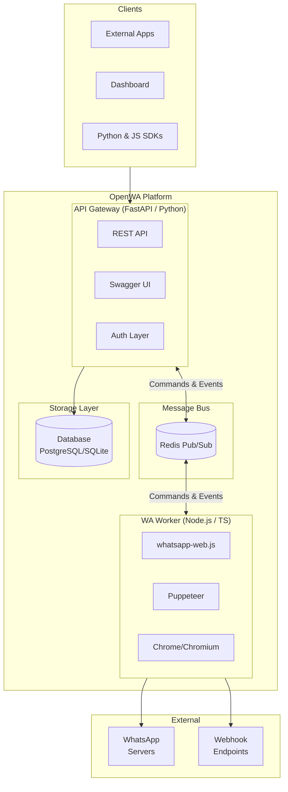
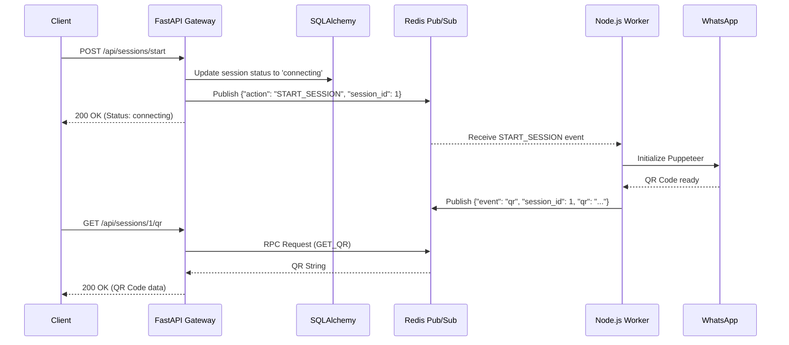
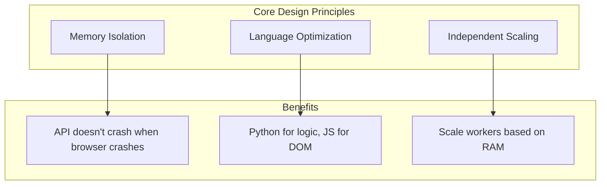
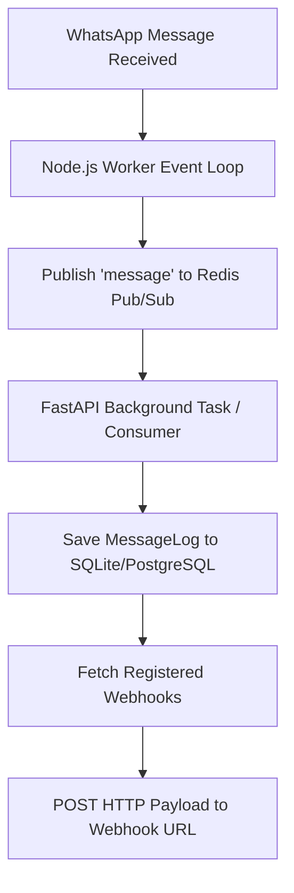

# 03 - System Architecture

## 3.1 Architecture Overview

### High-Level Architecture



### Component Interaction



## 3.2 The Hybrid Architecture Philosophy

OpenWA shifted from a monolithic Node.js design to a **Hybrid Architecture** that explicitly divides responsibilities based on runtime strengths:

1. **API Gateway (Python/FastAPI)**: Handles HTTP requests, authentication, database storage, and input validation. Python excels at API routing, ORM abstractions (SQLAlchemy), and has massive adoption for enterprise AI/Data workloads.
2. **Message Bus (Redis)**: Acts as the strict decoupling layer. The API Gateway never calls the browser directly.
3. **Engine Worker (Node.js)**: Runs in the background, listening to Redis. It uses `whatsapp-web.js` to control headless Chromium browsers. Node.js is uniquely positioned to handle DOM manipulations, V8 engine events, and the asynchronous event loop required by Puppeteer.

### Why Decouple?



## 3.3 Folder Structure

The repository is structured as a monorepo containing distinct logical units:

```text
OpenWA-Python/
├── api-gateway/            # Python FastAPI backend
│   ├── main.py             # Entrypoint
│   ├── models.py           # SQLAlchemy database schemas
│   ├── schemas.py          # Pydantic validation schemas
│   ├── routers/            # API Endpoints (sessions, messages, etc)
│   └── redis_client.py     # Redis RPC and Pub/Sub wrappers
│
├── wa-worker/              # Node.js TypeScript Worker
│   ├── src/index.ts        # Redis listener and WA initialization
│   ├── src/webhook.ts      # Webhook delivery system
│   └── package.json        # Dependencies (whatsapp-web.js, ioredis)
│
├── sdk/                    # Official Client Libraries
│   ├── python/             # Python SDK client
│   └── javascript/         # JS/TS SDK client
│
└── test/                   # Comprehensive Test Suite
    ├── unit/
    │   ├── api-gateway/    # Pytest unit tests for FastAPI routers
    │   ├── wa-worker/      # Jest unit tests for the worker
    │   └── sdk-*/          # Jest/Pytest unit tests for SDKs
    └── integration/        # End-to-end Python/Redis flow tests
```

## 3.4 Data Flow Diagrams

### 3.4.1 Send Message Flow

```mermaid
flowchart LR
    subgraph Client["1. Client"]
        A[External App] -->|POST /messages| B[FastAPI Gateway]
    end
    
    subgraph API["2. Gateway"]
        B --> C[Validate API Key]
        C --> D[Pydantic Validation]
        D --> E[RPC Request over Redis]
    end
    
    subgraph Worker["3. WA Worker"]
        E --> F[Listen to Command]
        F --> G[Locate WA Client]
        G --> H[Client.sendMessage()]
    end
    
    subgraph Network["4. WhatsApp Network"]
        H --> I[Meta Servers]
        I --> J[Success ACK]
    end
    
    subgraph Callback["5. Persistence"]
        J --> K[Publish 'message_ack' to Redis]
        K --> L[FastAPI consumes and saves to DB]
    end
```

### 3.4.2 Webhook Delivery Flow

When the Node.js worker detects an incoming message from the `whatsapp-web.js` event loop:



## 3.5 Security Architecture

```mermaid
flowchart TB
    subgraph External["External Request"]
        R[HTTP Request]
    end
    
    subgraph GatewayLayer["FastAPI Gateway"]
        R --> HTTPS[Reverse Proxy (Nginx/Traefik)]
        HTTPS --> AUTH[API Key Dependency (`verify_api_key`)]
        AUTH --> DB[Check Key against SQLite]
        DB --> VAL[Pydantic Type Validation]
        VAL --> APP[Router Execution]
    end
```

1. **Authentication**: Handled instantly at the gateway level using FastAPI dependency injection (`Depends(verify_api_key)`).
2. **Type Safety**: All incoming JSON payloads are structurally validated by Pydantic before business logic is executed.
3. **Internal Security**: Redis is strictly used as an internal event bus. External clients never hit Redis or the Node.js worker directly.
