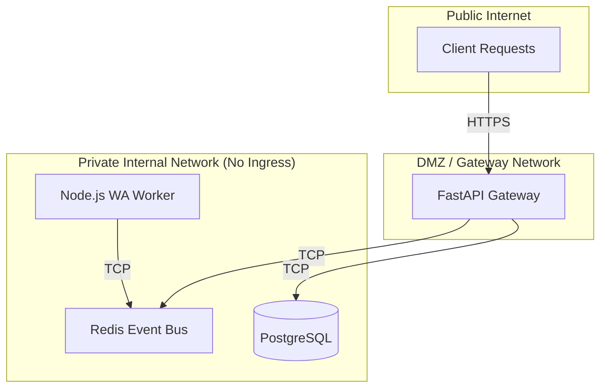

# 04 - Security Design

OpenWA is designed to be deployed securely out of the box, mitigating common API attack vectors and ensuring that the underlying Puppeteer browsers cannot be exploited.

## 4.1 FastAPI Security Layers

The API Gateway is built on FastAPI, which provides robust built-in security features.

### Authentication (API Keys)
All endpoints (except `/docs` and `/health`) are secured via the `X-API-Key` HTTP header.
This is implemented natively using FastAPI's dependency injection system:

```python
from fastapi import Security, HTTPException, Depends
from fastapi.security.api_key import APIKeyHeader
from database import get_db

api_key_header = APIKeyHeader(name="X-API-Key", auto_error=False)

async def verify_api_key(
    api_key_header: str = Security(api_key_header),
    db: Session = Depends(get_db)
):
    if not api_key_header:
        raise HTTPException(status_code=401, detail="API Key is missing")
    
    # Query database...
    if not is_valid:
        raise HTTPException(status_code=403, detail="Invalid API Key")
    
    return api_key_header
```
Because this is injected directly into the route handlers (`Depends(verify_api_key)`), it is impossible to accidentally expose an endpoint.

### Input Validation (Pydantic)
SQL injection and buffer overflow attacks are heavily mitigated by Pydantic. All incoming JSON bodies are strictly type-checked before they ever reach business logic. If a client sends an integer where a string is expected, FastAPI immediately drops the request with a `422 Unprocessable Entity` error.

## 4.2 Network Isolation

The Node.js `wa-worker` and the Redis cluster should **never** be exposed to the public internet.


Only the FastAPI Gateway accepts HTTP traffic. The Worker purely listens to Redis. This drastically reduces the attack surface of the massive Chromium browser dependencies.

## 4.3 Node.js Worker Security

Puppeteer runs a full Chromium browser. To prevent browser-based exploits:
1. **No Sandbox Flag**: In Docker, Puppeteer is often run with `--no-sandbox`. While necessary for standard Docker containers, it is recommended to run OpenWA using Docker capabilities (`--cap-add=SYS_ADMIN`) so the Chromium sandbox remains enabled.
2. **Read-Only Media**: Incoming media files downloaded from WhatsApp should be treated as untrusted and stored in sandboxed directories.
