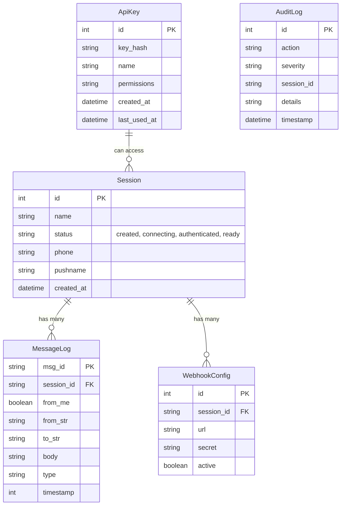

# 05 - Database Design

## 5.1 Architecture Philosophy

OpenWA utilizes **SQLAlchemy**, the premier Python SQL toolkit and Object Relational Mapper (ORM). 

The goal of the database layer in OpenWA is strictly to persist long-term state (sessions, API keys, logs). Temporary or highly volatile state (e.g., active WebSocket connections, Puppeteer browser PID status) is managed in memory or via Redis, *not* in the SQL database.

### Default Database
By default, OpenWA uses **SQLite**. This provides a zero-configuration, incredibly fast database that runs out of the box, perfect for single-tenant or low-volume deployments.

### Production Database
For multi-node scaling or high-throughput enterprise use, the system seamlessly transitions to **PostgreSQL** by simply updating the `DATABASE_URL` environment variable.

## 5.2 Schema Design

### Entity Relationship Diagram



## 5.3 SQLAlchemy Implementation

Our data models are defined using SQLAlchemy's Declarative Mapping system in `api-gateway/models.py`.

### Example: Session Model

```python
from sqlalchemy import Column, Integer, String, DateTime
from sqlalchemy.sql import func
from database import Base

class Session(Base):
    __tablename__ = "sessions"

    id = Column(Integer, primary_key=True, index=True)
    name = Column(String, unique=True, index=True)
    status = Column(String, default="created")  # created, connecting, authenticated, ready, disconnected
    phone = Column(String, nullable=True)
    pushname = Column(String, nullable=True)
    created_at = Column(DateTime(timezone=True), server_default=func.now())
```

## 5.4 Best Practices

1. **Dependency Injection**: Use FastAPI's dependency injection (`Depends(get_db)`) to pass the database session to your routers. This guarantees that connections are pooled and safely closed after every HTTP request.
2. **Migrations**: When making changes to the schema, use Alembic to generate migration scripts. *Do not modify the production tables manually.*
3. **No Heavy Analytical Queries**: Avoid running massive `GROUP BY` or analytical queries directly on the production operational database.
4. **Use Pydantic**: Incoming JSON should be validated using Pydantic models (`schemas.py`) before being mapped into SQLAlchemy ORM models (`models.py`) and committed to the database.
