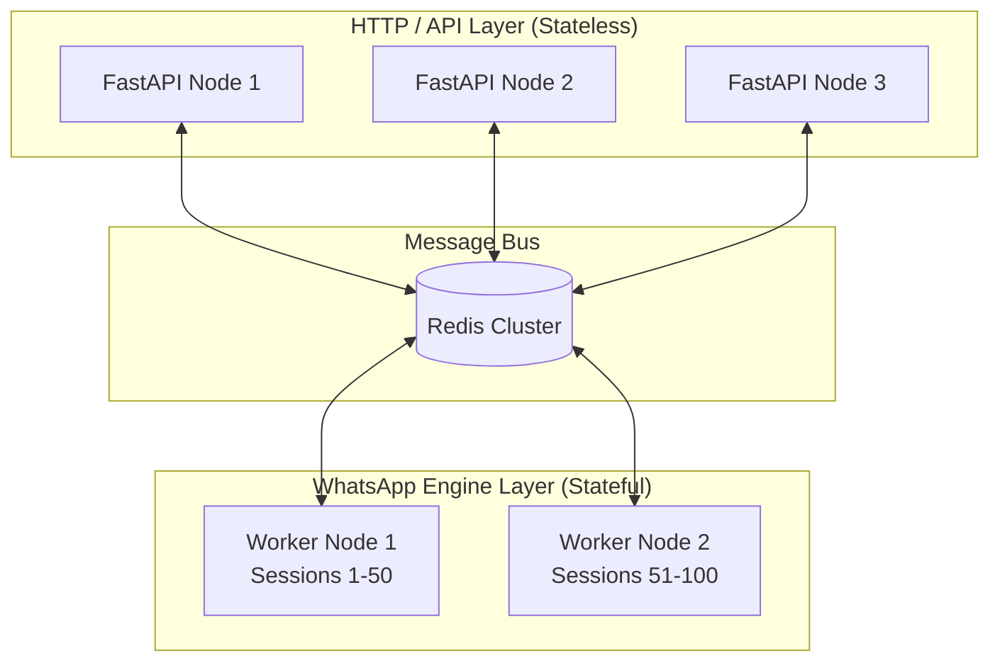

# 13 - Horizontal Scaling

Scaling a WhatsApp API wrapper is notoriously difficult because Puppeteer instances (Chromium) are extremely heavy, memory-intensive, and fundamentally stateful (each session requires a local `.wwebjs_auth` session directory).

OpenWA solves this scaling dilemma through its **Hybrid Architecture**.

## 13.1 The Asymmetric Scaling Model

Because the API Gateway (FastAPI) and the Engine (Node.js) are completely decoupled by Redis Pub/Sub, they can be scaled asymmetrically.

### 1. Scaling the API Gateway (Horizontal / Stateless)
FastAPI is stateless. You can spin up 10 instances of the `api-gateway` behind a load balancer (like Nginx) to handle massive spikes in inbound HTTP traffic. They all connect to the same PostgreSQL database and the same Redis instance.

### 2. Scaling the Workers (Vertical + Stateful Sharding)
The `wa-worker` processes are stateful. They actually hold the active WebSockets to the WhatsApp servers.
- **Vertical**: If you have 10 sessions, simply provision a larger VM with more RAM (e.g., 8GB RAM).
- **Horizontal Sharding**: For Enterprise deployments (100+ sessions), you can spin up multiple `wa-worker` containers across different servers. You will need to implement a Redis locking or routing mechanism to ensure Session #1 is only booted by Worker A, and Session #2 is booted by Worker B. *(Note: Dynamic sharding is planned for a future release).*

## 13.2 Shared Storage Requirement

Because `whatsapp-web.js` stores authentication credentials on the filesystem (`.wwebjs_auth`), if you run multiple `wa-worker` containers, they **must** share a persistent volume (e.g., AWS EFS, NFS, or a mounted Docker volume) so that if Worker A dies and Worker B takes over Session #1, it still has access to the authentication tokens.

Alternatively, custom authentication strategies can be injected into `whatsapp-web.js` to store session tokens directly in PostgreSQL.
