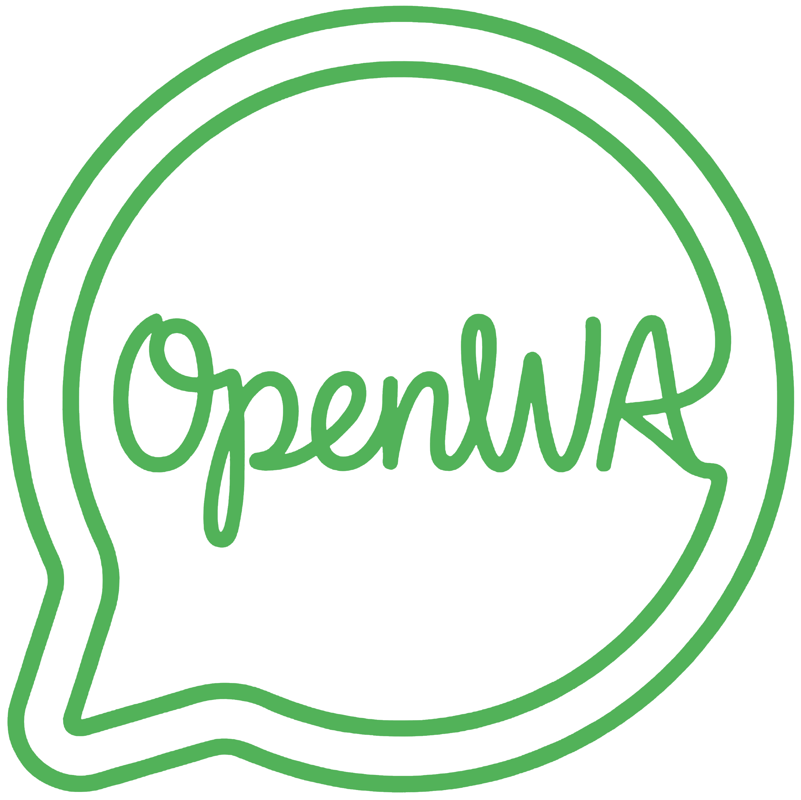

  

<h1 align="center">OpenWA-Python Documentation</h1>

  <strong>Official Python SDK for the OpenWA WhatsApp API Gateway</strong>

  
  
  

---

## 📚 Documentation Index

| Guide | Description |
| :--- | :--- |
| **[01 - Getting Started](./01-getting-started.md)** | Installation, Docker setup, and first API requests |
| **[02 - Architecture](./02-architecture.md)** | System overview between OpenWA Engine and the Python SDK |
| **[03 - SDK Reference](./03-sdk-reference.md)** | Complete API reference for synchronous and asynchronous clients |
| **[04 - Development & Testing](./04-development-testing.md)** | Local development, formatting, and Pytest test suite |
